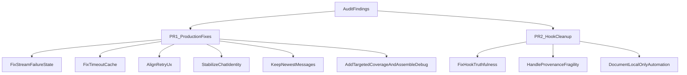

# Audit Remediation Plan

## Goal

Ship a first PR that fixes the highest-risk production issues in AuraChat, then follow with a smaller PR for `.claude` hook cleanup. The first PR should prioritize correctness, data integrity, and UI behavior alignment over test pass status.

## Phase 1: Production Fix PR

Focus on the app code paths that can mislead users or persist bad state.

### 1. Fix streamed reply failure semantics

Update [DefaultConversationRepository.kt](/Users/patricklarocque/IdeaProjects/AuraChat/app/src/main/java/com/personal/aurachat/data/repository/DefaultConversationRepository.kt) so a stream that emits partial text and then errors is not silently treated as success.

Key behaviors to change:

- If streaming ends with an error, do not return `SendMessageResult.Success` just because `fullContent` is non-blank.
- Decide a single consistent persisted outcome for partial failures: either mark the assistant message `FAILED` with partial content preserved, or replace the content with a friendly failure message while preserving the failed state.
- Re-throw `CancellationException` instead of converting lifecycle cancellation into `UNKNOWN` failures.

Essential code path:

```145:216:app/src/main/java/com/personal/aurachat/data/repository/DefaultConversationRepository.kt
private suspend fun requestAssistantReply(conversationId: Long): SendMessageResult {
    val timeoutMillis = settingsRepository.observeTimeoutMillis().first()
    // ...
    try {
        aiService.streamReply(/* ... */).collect { result ->
            when (result) {
                is AiResult.Success -> { /* append chunk */ }
                is AiResult.Error -> { lastError = result }
            }
        }
    } catch (e: Exception) {
        lastError = AiResult.Error(AiErrorType.UNKNOWN, e.message)
    }
    // currently only fails when fullContent.isBlank()
}
```

### 2. Make timeout changes actually apply

Update [GoogleAiService.kt](/Users/patricklarocque/IdeaProjects/AuraChat/app/src/main/java/com/personal/aurachat/data/remote/GoogleAiService.kt) so model caching includes timeout, or remove the model cache if timeout-safe caching is not viable.

Files:

- [GoogleAiService.kt](/Users/patricklarocque/IdeaProjects/AuraChat/app/src/main/java/com/personal/aurachat/data/remote/GoogleAiService.kt)
- [SettingsViewModel.kt](/Users/patricklarocque/IdeaProjects/AuraChat/app/src/main/java/com/personal/aurachat/presentation/settings/SettingsViewModel.kt)
- [SettingsScreen.kt](/Users/patricklarocque/IdeaProjects/AuraChat/app/src/main/java/com/personal/aurachat/ui/settings/SettingsScreen.kt)

Because you chose to keep timeout autosave, the UI plan should make that explicit, for example by changing labels/helper text so users understand timeout saves immediately while API key uses the button.

### 3. Align retry UX with actual behavior

Because you chose `retry latest failed only`, keep the repository contract but change the UI so it no longer implies per-bubble retry.

Files:

- [MessageBubble.kt](/Users/patricklarocque/IdeaProjects/AuraChat/app/src/main/java/com/personal/aurachat/ui/components/MessageBubble.kt)
- [ChatScreen.kt](/Users/patricklarocque/IdeaProjects/AuraChat/app/src/main/java/com/personal/aurachat/ui/chat/ChatScreen.kt)
- [ChatViewModel.kt](/Users/patricklarocque/IdeaProjects/AuraChat/app/src/main/java/com/personal/aurachat/presentation/chat/ChatViewModel.kt)
- [DefaultConversationRepository.kt](/Users/patricklarocque/IdeaProjects/AuraChat/app/src/main/java/com/personal/aurachat/data/repository/DefaultConversationRepository.kt)

Plan direction:

- Remove or redesign per-message retry affordances.
- Add a single conversation-level retry action or otherwise label it clearly as retrying the latest failed response.
- Keep naming and UI copy consistent with that behavior.

### 4. Fix new-chat identity and long-chat retrieval

Stabilize chat navigation identity and ensure message queries keep the visible tail of the conversation.

Files:

- [AuraChatNavGraph.kt](/Users/patricklarocque/IdeaProjects/AuraChat/app/src/main/java/com/personal/aurachat/ui/navigation/AuraChatNavGraph.kt)
- [ChatViewModel.kt](/Users/patricklarocque/IdeaProjects/AuraChat/app/src/main/java/com/personal/aurachat/presentation/chat/ChatViewModel.kt)
- [AuraChatDao.kt](/Users/patricklarocque/IdeaProjects/AuraChat/app/src/main/java/com/personal/aurachat/data/local/AuraChatDao.kt)
- [ChatScreen.kt](/Users/patricklarocque/IdeaProjects/AuraChat/app/src/main/java/com/personal/aurachat/ui/chat/ChatScreen.kt)

Plan direction:

- Replace `chat/-1`-only identity with a route/back stack strategy that can represent the real conversation after creation.
- Change message retrieval to preserve newest messages when the query limit is hit.
- Re-check auto-scroll/jump-to-latest assumptions after the DAO query change.

### 5. Raise verification quality beyond a green unit test

Use tests and build verification as evidence, but not as proof of correctness.

Verification plan for the first PR:

- Add repository-focused tests around streaming success, partial-stream failure, timeout propagation, retry behavior, and cancellation.
- Add query-focused tests for newest-message retention.
- Run [assembleDebug](/Users/patricklarocque/IdeaProjects/AuraChat/CLAUDE.md) after fixes.
- Use code review reasoning to confirm the failure-state transitions and UI semantics match the product intent.

## Phase 2: Hook Cleanup PR

After the production PR lands, clean up local automation so it is truthful and less fragile.

Files:

- [.claude/settings.local.json](/Users/patricklarocque/IdeaProjects/AuraChat/.claude/settings.local.json)
- [.claude/hooks/pre-commit-lint.sh](/Users/patricklarocque/IdeaProjects/AuraChat/.claude/hooks/pre-commit-lint.sh)
- [.claude/hooks/post-edit-run-viewmodel-tests.sh](/Users/patricklarocque/IdeaProjects/AuraChat/.claude/hooks/post-edit-run-viewmodel-tests.sh)
- [.claude/hooks/post-edit-log-warning.sh](/Users/patricklarocque/IdeaProjects/AuraChat/.claude/hooks/post-edit-log-warning.sh)
- [.claude/hooks/post-tool-call.py](/Users/patricklarocque/IdeaProjects/AuraChat/.claude/hooks/post-tool-call.py)

Plan direction:

- Make hook messaging accurate about what is actually being checked.
- Avoid running unrelated `ChatViewModelTest` for all `ViewModel` edits.
- Decide whether `post-tool-call.py` should fail open if the provenance sidecar is absent.
- Document clearly that these are local Claude hooks, not repo-enforced git hooks.

## Proposed PR Structure




## PR 1 Output

The first PR should be framed as a correctness and UX-alignment PR, not a test-only PR. The summary should emphasize:

- streamed failure states are now persisted consistently
- timeout changes now affect live requests
- retry behavior now matches what the UI communicates
- newly created and long-running chats behave more predictably

## Blocking Questions

None at the moment. The main product decisions needed for planning were answered: keep hooks separate, keep latest-failed retry semantics, and keep timeout autosave with clearer UI.